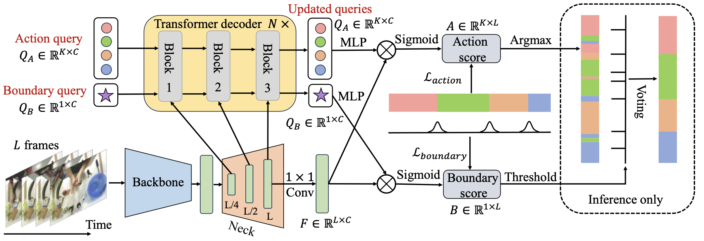

# ASQuery: A Query-Based Model For Action Segmentation
## Introduction
This repository provides a PyTorch implementation of the paper "ASQuery: A Query-Based Model For Action Segmentation". It should be noted that the current version of the code has some redundancy. A cleaned-up version of the code will be released later.

<div align="center">
  
</div>

## Installation
Follow INSTALL.md for installing necessary dependencies.
## To Reproduce Our Results on Breakfast
**Prepare dataset**
* Download dataset refer to [MS-TCN](https://github.com/yabufarha/ms-tcn).
* Unpack the file under *./data* (or elsewhere and link to *./data*).
* The folder structure should look like
```
This folder
│   README.md
│   ...  
│
└───data/
│    └───breakfast/
│    │	 └───features/
│    │	 └───groundTruth/
│    │	 └───splits/
│    │	 └───mapping.txt  
│    └───...
|
└───libs
│
│   ...
```
**Training and Evaluation**
* To train our ASQuery. This will create an experiment folder under ./ckpt that stores training config, logs, and checkpoints.
```shell
python main.py configs/breakfast/config.yaml --output result
```
* [Optional] Monitor the training using TensorBoard
```shell
tensorboard --logdir=./ckpt/breakfast/config_result/logs
```
* Evaluate the trained model.
```shell
python eval.py configs/breakfast/config.yaml ckpt/breakfast/config_result
```
## Acknowledgement
[ActionFormer](https://github.com/happyharrycn/actionformer_release): The main codebase we built upon and it is an wonderful model.
